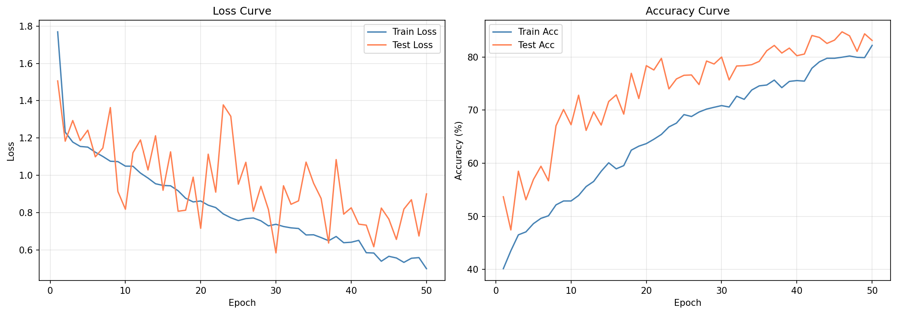
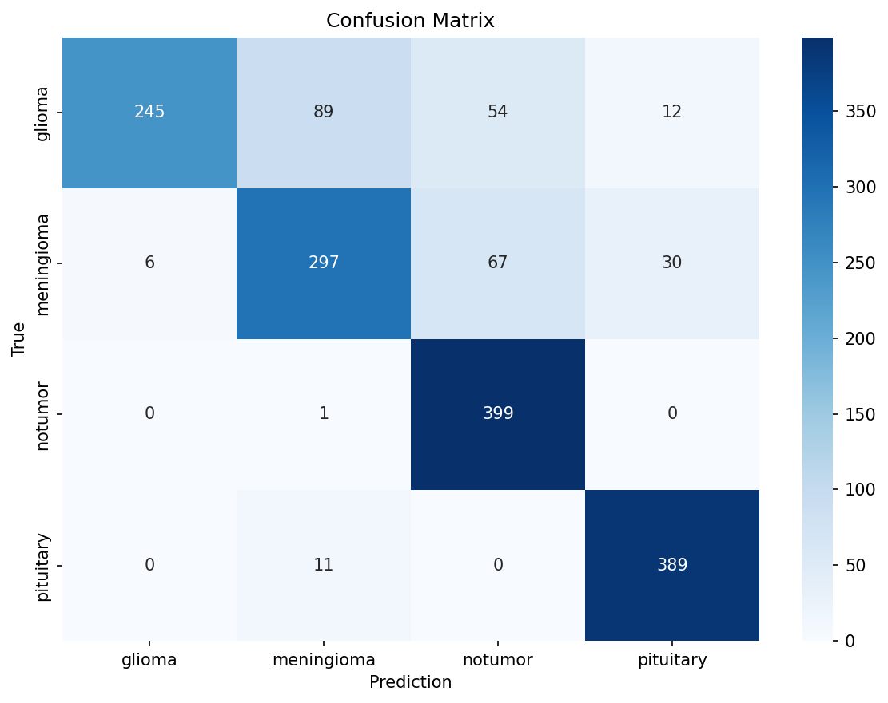
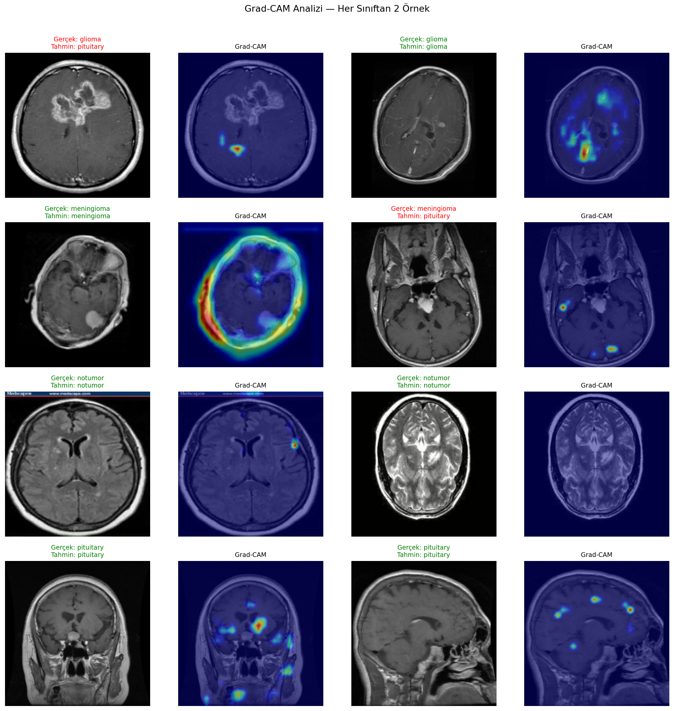

# Brain Tumor CNN

A custom Convolutional Neural Network for multi-class brain tumor classification from MRI scans, implemented from scratch in PyTorch based on the architecture proposed in a [Scientific Reports (2026) paper](https://www.nature.com/articles/s41598-025-34806-6).

---

## Overview

This project classifies brain MRI images into 4 categories:

- **Glioma**
- **Meningioma**
- **No Tumor**
- **Pituitary**

The model achieves **83% test accuracy** on the [Brain Tumor MRI Dataset](https://www.kaggle.com/datasets/masoudnickparvar/brain-tumor-mri-dataset) (7,023 images) and includes Grad-CAM visualizations for explainability.

---

## Model Architecture

The CNN architecture follows the design proposed in *"Multi-class classification of brain tumors using optimized CNN and transfer learning techniques"* (Anand et al., Scientific Reports, 2026).

```
Input (3 × 224 × 224)
│
├── ConvBlock 1: Conv2d(3→32) → ReLU → BatchNorm → MaxPool → Dropout
├── ConvBlock 2: Conv2d(32→64) → ReLU → BatchNorm → MaxPool → Dropout
├── ConvBlock 3: Conv2d(64→128) → ReLU → BatchNorm → MaxPool
├── ConvBlock 4: Conv2d(128→256) → ReLU → BatchNorm → MaxPool
│
├── Flatten → Dropout(0.1) → Linear(50176→128) → ReLU → Linear(128→4)
│
Output (4 classes)
```

Total parameters: **590,084**

---

## Results

| Metric | Value |
|--------|-------|
| Test Accuracy | 83% |
| Epochs | 50 |
| Optimizer | Adam (lr=1e-3) |
| Scheduler | ReduceLROnPlateau |
| Loss | CrossEntropyLoss |

### Training Curves



### Confusion Matrix



### Per-class Performance

| Class | Precision | Recall | F1-Score |
|-------|-----------|--------|----------|
| Glioma | 0.98 | 0.61 | 0.75 |
| Meningioma | 0.75 | 0.74 | 0.74 |
| No Tumor | 0.77 | 1.00 | 0.87 |
| Pituitary | 0.90 | 0.97 | 0.94 |

Glioma shows the lowest recall (0.61), consistent with findings in the literature — glioma and meningioma share similar tissue textures, making them harder to distinguish.

---

## Grad-CAM Explainability

Gradient-weighted Class Activation Mapping (Grad-CAM) is applied to the last convolutional layer (`block4[0]`) to visualize which regions of the MRI the model focuses on when making predictions. This provides insight into whether the model is learning anatomically meaningful features rather than spurious correlations.



### Per-class Analysis

**Pituitary ✅**
The model consistently activates in the lower-central region of the brain — precisely where the pituitary gland is anatomically located. This is the strongest evidence that the model has learned clinically relevant spatial features, not just texture patterns.

**Meningioma ✅ / ❌**
In the correctly classified case, the activation forms a distinct ring-shaped pattern along the tumor boundary, which is a known visual characteristic of meningiomas. In the misclassified case (predicted as pituitary), the activation is weak and scattered across two small peripheral points — the model failed to localize the tumor entirely, likely due to image orientation or low contrast.

**Glioma ✅ / ❌**
Glioma is the most challenging class (recall: 0.61). In the misclassified example, a large tumor mass is clearly visible in the center of the scan, yet the model focuses on a small peripheral region in the lower-left corner — indicating it is attending to the wrong features. In the correctly classified case, activation is near but not precisely over the tumor, suggesting the correct prediction may be partially driven by texture rather than localization.

**No Tumor ✅**
Both examples show low-intensity, diffuse activations with no focal region — the expected behavior when no pathological structure is present. The model does not force attention onto any specific area, which is the correct response for healthy scans.

### Key Takeaway
Grad-CAM reveals that the model has learned anatomically meaningful representations for pituitary and meningioma tumors. The primary failure mode is glioma mislocalization — a known challenge in the literature due to glioma's diffuse and heterogeneous appearance compared to the more compact morphology of other tumor types.

---

## Dataset

**Brain Tumor MRI Dataset** by Masoud Nickparvar — available on [Kaggle](https://www.kaggle.com/datasets/masoudnickparvar/brain-tumor-mri-dataset).

- 7,023 MRI images across 4 classes
- Combined from figshare, SARTAJ, and Br35H datasets
- Pre-split into Training (5,712) and Testing (1,311) folders

---

## Data Preprocessing

**Train transforms:**
- Resize to 256×256 → RandomResizedCrop(224)
- RandomHorizontalFlip
- RandomRotation(15°)
- ColorJitter (brightness=0.2, contrast=0.2)
- Normalize (dataset mean/std computed on training set)

**Test transforms:**
- Resize to 224×224
- Normalize (same statistics)

---

## Project Structure

```
brain-tumor-cnn/
├── BrainTumorCNN.ipynb       # Main notebook (Colab)
├── assets/
│   ├── gradcam_analysis.png
│   ├── confusion_matrix.png
│   └── training_curves.png
└── README.md
```

---

## Requirements

```
torch
torchvision
torchinfo
scikit-learn
matplotlib
seaborn
opencv-python
numpy
```

---

## Reference

Anand, V., Khajuria, A., Pachauri, R. K., & Gupta, V. (2026). *Multi-class classification of brain tumors using optimized CNN and transfer learning techniques.* Scientific Reports, 16, 4709. https://doi.org/10.1038/s41598-025-34806-6
